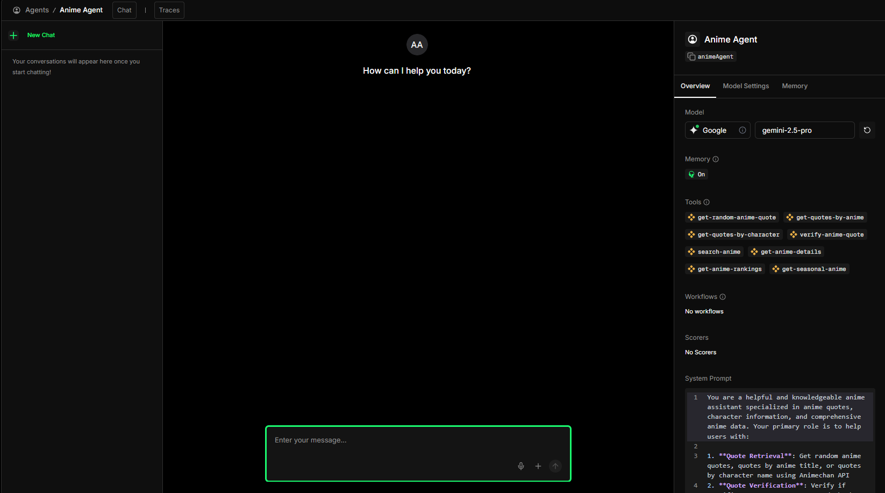
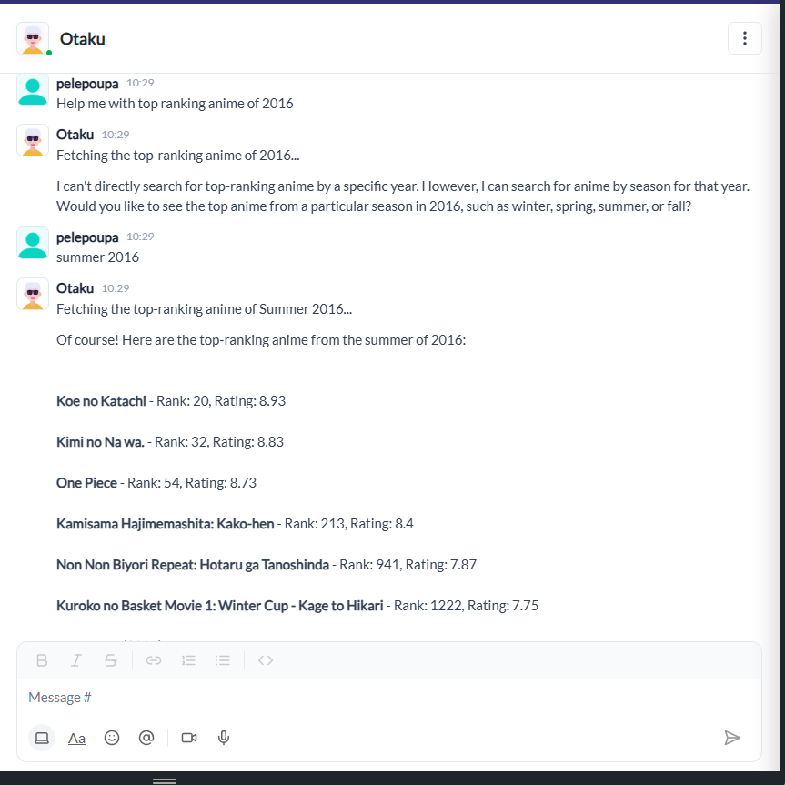

# Anime Quote Assistant with Mastra

A comprehensive AI-powered anime assistant built with [Mastra](https://docs.mastra.ai), featuring quote retrieval, verification, anime discovery, and seamless integration with external platforms via the Agent-to-Agent (A2A) protocol.

## 🎯 Features

### Anime Quote Management
- **Random Quotes**: Get random anime quotes for inspiration
- **Quotes by Anime**: Retrieve quotes from specific anime series
- **Quotes by Character**: Find quotes from favorite characters
- **Quote Verification**: Verify if specific quotes are accurate and identify the character who said them

### Anime Discovery & Information
- **Anime Search**: Search for anime by title or keywords
- **Detailed Information**: Get comprehensive anime details including synopsis, ratings, genres, and more
- **Anime Rankings**: Access top anime rankings (all-time, airing, upcoming, TV, movies)
- **Seasonal Anime**: Discover anime for specific seasons and years

### Platform Integration
- **A2A Protocol**: Full Agent-to-Agent (A2A) communication support
- **Telex.im Integration**: Connect to Telex and other A2A-compliant platforms
- **JSON-RPC 2.0**: Standardized communication protocol
- **Auto-Discovery**: Agent capabilities automatically exposed via API

### Additional Features
- **Conversation Memory**: Persistent memory using LibSQLStore
- **Multi-Step Workflows**: Complex quote verification workflows
- **Observability**: Built-in logging and tracing
- **Type Safety**: Full TypeScript support with Zod validation

## 🛠️ Tech Stack

- **Framework**: [Mastra](https://docs.mastra.ai) - TypeScript AI agent framework
- **Runtime**: Node.js >= 20.9.0
- **Language**: TypeScript
- **Storage**: LibSQL (SQLite)
- **APIs**:
  - [Animechan API](https://animechan.io/) - Anime quotes
  - [MyAnimeList API](https://myanimelist.net/apiconfig/references/api/v2) - Anime data
- **AI Model**: Google Gemini 2.5 Pro
- **Package Manager**: pnpm

## 📋 Prerequisites

- **Node.js**: Version 20.9.0 or higher
- **pnpm**: Latest version (install with `npm install -g pnpm`)
- **MyAnimeList Client ID**: (Optional) For MyAnimeList API access

## 🚀 Installation

1. **Clone the repository**
   ```bash
   git clone <repository-url>
   cd dooshen-study
   ```

2. **Install dependencies**
   ```bash
   pnpm install
   ```

3. **Set up environment variables**
   Create a `.env` file in the root directory:
   ```env
   # MyAnimeList API (Optional - has default value)
   MAL_CLIENT_ID=your_mal_client_id_here
   
   # Mastra Server (Optional - defaults to localhost:4111)
   MASTRA_BASE_URL=http://localhost:4111
   ```

   **Note**: The MyAnimeList API uses a default Client ID if not provided. For production use, you should [register your own application](https://myanimelist.net/apiconfig).

4. **Build the project**
   ```bash
   pnpm run build
   ```

## 🎮 Usage

### Development Mode

Start the Mastra development server:

```bash
pnpm dev
```

This will:
- Start the server on `http://localhost:4111` (default)
- Enable hot reloading
- Expose API endpoints including:
  - `/a2a/agent/:agentId` - Main A2A endpoint
  - `/a2a/agent/:agentId/card` - Agent capabilities
  - `/a2a/agent/:agentId/message` - Direct messaging
  - Swagger UI at `/swagger` (if enabled)

### Mastra Playground

Access the Mastra Playground UI to interact with your agents visually:


*Screenshot: Mastra Playground interface showing agent interactions and testing capabilities.*

The playground provides:
- Visual agent interaction interface
- Real-time conversation testing
- Tool execution monitoring
- Workflow visualization
- Memory and context inspection

### Production Mode

1. **Build the project**
   ```bash
   pnpm run build
   ```

2. **Start the server**
   ```bash
   pnpm start
   ```

### Testing A2A Endpoints

Run the comprehensive test suite:

```bash
pnpm run test-a2a
```

This will test:
- Agent card retrieval
- JSON-RPC 2.0 messaging
- Direct messaging
- MyAnimeList API integration
- Quote verification workflows

**Note**: Tests include 2-minute delays between requests to respect API rate limits.

### Using the Agents

#### Via API

**Get Agent Card (Capabilities)**
```bash
curl http://localhost:4111/a2a/agent/animeAgent/card
```

**Send Message (JSON-RPC 2.0)**
```bash
curl -X POST http://localhost:4111/a2a/agent/animeAgent \
  -H "Content-Type: application/json" \
  -d '{
    "jsonrpc": "2.0",
    "id": 1,
    "method": "message",
    "params": {
      "message": "Get me a random anime quote"
    }
  }'
```

**Direct Message**
```bash
curl -X POST http://localhost:4111/a2a/agent/animeAgent/message \
  -H "Content-Type: application/json" \
  -d '{
    "message": "Search for One Piece anime"
  }'
```

#### Via Mastra Client

```typescript
import { MastraClient } from '@mastra/core';
import { mastra } from './src/mastra/index';

// Get agent response
const response = await mastra.getAgent('animeAgent').generate({
  messages: [{ role: 'user', content: 'Get me a random quote from Naruto' }],
});
```

## 📁 Project Structure

```
dooshen-study/
├── src/
│   └── mastra/
│       ├── index.ts                 # Main Mastra instance configuration
│       ├── agents/
│       │   ├── anime-agent.ts       # Anime Agent definition
│       │   └── weather-agent.ts     # Weather Agent definition
│       ├── tools/
│       │   ├── animechan-tools.ts   # Animechan API tools (4 tools)
│       │   ├── myanimelist-tools.ts # MyAnimeList API tools (4 tools)
│       │   └── weather-tool.ts      # Weather API tool
│       ├── workflows/
│       │   ├── anime-quote-verification-workflow.ts
│       │   └── weather-workflow.ts
│       ├── routes/
│       │   └── a2a-agent-route.ts   # A2A protocol route handlers
│       ├── scorers/
│       │   └── weather-scorer.ts    # Evaluation scorers
│       └── storage/
│           └── r2-storage-service.ts # Storage service (optional)
├── docs/                             # Documentation
├── examples/                         # Example code
├── test-a2a-endpoint.ts             # A2A endpoint test suite
├── package.json
├── tsconfig.json
└── README.md
```

## 🤖 Agents

### Anime Agent

The primary agent for anime-related tasks:

- **Name**: `animeAgent`
- **Model**: Google Gemini 2.5 Pro
- **Tools**: 8 tools (4 Animechan + 4 MyAnimeList)
- **Memory**: Persistent conversation history
- **Capabilities**:
  - Quote retrieval and verification
  - Anime search and discovery
  - Ranking and seasonal anime tracking
  - Comprehensive anime information

### Weather Agent

Secondary agent for weather information:

- **Name**: `weatherAgent`
- **Model**: Google Gemini 2.5 Pro
- **Tools**: Weather API tool
- **Scorers**: Tool call appropriateness, completeness, translation

## 🔧 Tools

### Animechan Tools (4)

1. **getRandomQuoteTool**: Fetch random anime quotes
2. **getQuotesByAnimeTool**: Get quotes from specific anime series
3. **getQuotesByCharacterTool**: Get quotes from specific characters
4. **verifyAnimeQuoteTool**: Verify if a quote is accurate

### MyAnimeList Tools (4)

1. **searchAnimeTool**: Search anime by title or keywords
2. **getAnimeDetailsTool**: Get detailed anime information by ID
3. **getAnimeRankingsTool**: Retrieve top anime rankings
4. **getSeasonalAnimeTool**: Get anime for specific seasons

## 🔄 Workflows

### Anime Quote Verification Workflow

Multi-step workflow for verifying anime quotes:

1. **Search Quotes**: Search for quotes by character/anime
2. **Collect Quotes**: Aggregate quotes from multiple sources
3. **Verify Quote**: AI-powered matching and verification
4. **Generate Report**: Comprehensive verification report

## 🌐 A2A Protocol Integration

The project implements the Agent-to-Agent (A2A) protocol for external platform integration:

### Endpoints

- `POST /a2a/agent/:agentId` - Main JSON-RPC 2.0 endpoint
- `GET /a2a/agent/:agentId/card` - Agent capabilities discovery
- `POST /a2a/agent/:agentId/message` - Simplified message endpoint

### JSON-RPC 2.0 Format

All responses follow the JSON-RPC 2.0 specification:

```json
{
  "jsonrpc": "2.0",
  "id": 1,
  "result": {
    "message": "Agent response text",
    "artifacts": [],
    "history": []
  }
}
```

### Integration with Telex

See [Telex Integration Guide](./docs/telex-integration-guide.md) for detailed instructions on connecting to Telex.im.


*Screenshot: The Anime Agent communicating with Telex.im via the A2A protocol, showing real-time agent interactions and responses.*

## 📚 API Documentation

When the server is running, access:

- **Swagger UI**: `http://localhost:4111/swagger`
- **OpenAPI Docs**: `http://localhost:4111/openapi.json`

## 🧪 Testing

### Test A2A Endpoints

```bash
pnpm run test-a2a
```

The test suite includes:
- Agent card retrieval
- JSON-RPC 2.0 messaging
- Direct messaging
- MyAnimeList integration
- Quote verification

### Manual Testing

Use the provided `test-a2a-endpoint.ts` script or test with `curl`:

```bash
# Test agent card
curl http://localhost:4111/a2a/agent/animeAgent/card

# Test message
curl -X POST http://localhost:4111/a2a/agent/animeAgent/message \
  -H "Content-Type: application/json" \
  -d '{"message": "Get a random quote"}'
```

## 🚢 Deployment

### Mastra Cloud

1. Visit [Mastra Cloud](https://cloud.mastra.ai/)
2. Connect your GitHub repository
3. Configure environment variables
4. Deploy automatically

### Manual Deployment

1. **Build the project**
   ```bash
   pnpm run build
   ```

2. **Deploy the `.mastra/output` directory** to your hosting platform:
   - Vercel
   - Netlify
   - Railway
   - Any Node.js-compatible hosting

3. **Set environment variables** on your hosting platform:
   - `MAL_CLIENT_ID` (optional)
   - `MASTRA_BASE_URL` (if different from default)

### Environment Variables

- `MAL_CLIENT_ID`: MyAnimeList API Client ID (optional, has default)
- `MASTRA_BASE_URL`: Base URL for Mastra server (default: `http://localhost:4111`)

## 📖 Documentation

Additional documentation is available in the `docs/` directory:

- [A2A Quick Start](./docs/a2a-quick-start.md)
- [A2A Protocol Guide](./docs/a2a-protocol-guide.md)
- [Telex Integration Guide](./docs/telex-integration-guide.md)
- [Storage Providers Guide](./docs/storage-providers-guide.md)
- [About Scorers](./docs/about-scorers.md)

## 🔍 Observability

The project includes built-in observability:

- **Logging**: PinoLogger for structured logging
- **Tracing**: Execution traces for agents and tools
- **Storage**: Metrics and scores stored in LibSQL
- **Error Tracking**: Comprehensive error handling and reporting

## 🛡️ Error Handling

The project implements robust error handling:

- **API Failures**: Graceful degradation when APIs are unavailable
- **Rate Limiting**: Built-in awareness and respectful API usage
- **Type Validation**: Zod schemas catch errors early
- **JSON-RPC Errors**: Proper error codes and messages for A2A protocol

## 🤝 Contributing

Contributions are welcome! Please:

1. Fork the repository
2. Create a feature branch (`git checkout -b feature/amazing-feature`)
3. Commit your changes (`git commit -m 'Add amazing feature'`)
4. Push to the branch (`git push origin feature/amazing-feature`)
5. Open a Pull Request

## 📝 License

ISC

## 🙏 Acknowledgments

- [Mastra](https://docs.mastra.ai) - The amazing AI agent framework
- [Animechan](https://animechan.io/) - Free anime quotes API
- [MyAnimeList](https://myanimelist.net/) - Comprehensive anime database
- [Telex.im](https://telex.im) - AI agent platform for teams and communities

## 📞 Support

For issues, questions, or contributions:

- Check the [Mastra Documentation](https://docs.mastra.ai)
- Review the [docs](./docs/) directory
- Open an issue on GitHub

---

**Built with ❤️ using Mastra**

